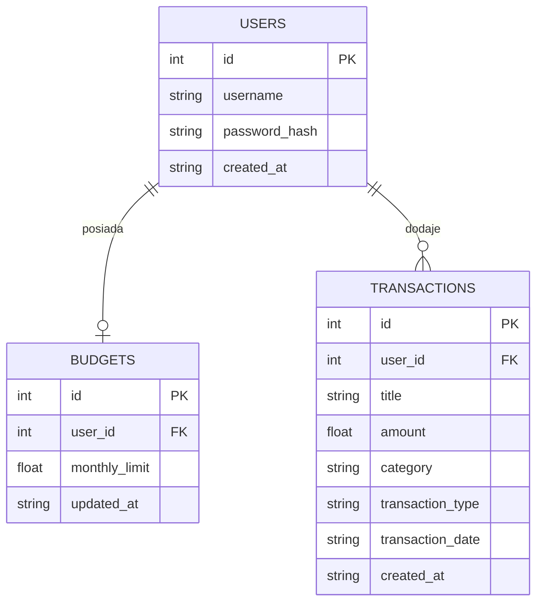

# Rozwoj warstwy danych i plan wersji profesjonalnej - stan na 2026-05-23

## 1. Osoba odpowiedzialna

Aniela Wrobel - DBA, Dokumentalista

## 2. Cel dokumentu

Celem dokumentu jest pokazanie, w jaki sposob obecna warstwa danych aplikacji BudgetBuddy wspiera juz wdrozone funkcje oraz jakie zmiany nalezy zaplanowac, aby projekt mogl zostac rozbudowany do bardziej profesjonalnej wersji.

Dokument stanowi pomost pomiedzy:

- obecnym stanem technicznym aplikacji,
- koncowa dokumentacja projektu,
- przyszla, bardziej dojrzala wersja systemu.

## 3. Aktualny stan warstwy danych

Na obecnym etapie projekt wykorzystuje:

- lokalna baze `SQLite`,
- trzy glowne tabele:
  - `users`,
  - `budgets`,
  - `transactions`.

Obecna baza wspiera juz:

- rejestracje i logowanie uzytkownikow,
- ustawianie budzetu miesiecznego,
- dodawanie transakcji,
- edycje transakcji,
- usuwanie transakcji,
- filtrowanie i sortowanie transakcji,
- wyliczanie podsumowan finansowych do dashboardu.

## 4. Diagram relacji obecnej wersji

## 5. Jak obecny model danych wspiera aktualne funkcje

### 5.1 Rejestracja i logowanie

Tabela `users` przechowuje dane potrzebne do uwierzytelniania oraz identyfikacji wlasciciela danych.

### 5.2 Ustawianie budzetu

Tabela `budgets` przechowuje jeden aktualny limit miesieczny dla jednego uzytkownika. Ograniczenie `UNIQUE` na `user_id` pozwala zachowac zasade jednego aktywnego budzetu.

### 5.3 Operacje na transakcjach

Tabela `transactions` wspiera:

- dodawanie nowych wpisow,
- edycje wpisow,
- usuwanie wpisow,
- filtrowanie po kategorii i typie,
- sortowanie po dacie i kwocie.

### 5.4 Dashboard i analityka

Podsumowania w dashboardzie sa obecnie liczone na podstawie danych z tabeli `transactions` oraz aktywnego limitu z tabeli `budgets`.

## 6. Ograniczenia obecnego modelu danych

Mimo ze obecna wersja dziala poprawnie, model danych ma ograniczenia typowe dla wczesniejszego etapu projektu:

- brak osobnej tabeli kategorii,
- brak historii zmian budzetu,
- brak tabeli lub struktury pod eksport danych,
- brak przygotowania pod bardziej rozbudowane raportowanie okresowe,
- brak rozdzielenia danych pomocniczych od danych operacyjnych,
- wykorzystanie `SQLite` zamiast docelowej serwerowej bazy danych.

## 7. Elementy potrzebne do wersji bardziej profesjonalnej

### 7.1 Osobna tabela kategorii

Obecnie kategorie sa przechowywane jako tekst. Wersja bardziej profesjonalna powinna wprowadzic np.:

- `categories`
  - `id`
  - `name`
  - `type`
  - `is_default`
  - `owner_user_id` lub `NULL` dla kategorii systemowych

Korzyosci:

- mozliwosc dodawania wlasnych kategorii,
- spojnosc nazewnictwa,
- latwiejsze raportowanie.

### 7.2 Historia budzetu

Obecna tabela `budgets` przechowuje tylko aktualny limit.

Wersja profesjonalna moglaby dodac:

- `budget_history`
  - `id`
  - `user_id`
  - `monthly_limit`
  - `valid_from`
  - `created_at`

Korzyosci:

- mozliwosc sledzenia zmian planu budzetowego,
- porownania pomiedzy okresami,
- lepsza analityka historyczna.

### 7.3 Przygotowanie pod eksport danych

Jesli projekt ma wspierac eksport danych, przydatne beda:

- spojne pola dat,
- przewidywalne identyfikatory wpisow,
- jednoznaczne rozroznienie typow transakcji,
- przygotowanie widokow lub zapytan pod eksport `CSV` albo `JSON`.

### 7.4 Przygotowanie pod raportowanie

Do bardziej rozbudowanego raportowania przydatne byloby:

- wydzielenie okresow raportowych,
- ujednolicenie kategorii,
- lepsze przygotowanie danych do agregacji miesiecznej,
- ewentualne indeksy dla czesto filtrowanych kolumn.

## 8. Proponowany model rozwoju warstwy danych

### Etap 1

Utrzymanie obecnego modelu, ale z lepsza dokumentacja i porzadkiem danych.

### Etap 2

Dodanie:

- tabeli kategorii,
- historii budzetu,
- przygotowania pod eksport i raporty.

### Etap 3

Przejscie na `PostgreSQL` oraz zastosowanie bardziej formalnych migracji, gdyby projekt mial byc rozwijany dalej po zaliczeniu.

## 9. Rekomendacje techniczne na final projektu

Przed zamknieciem projektu warto:

- utrzymac zgodnosc dokumentacji z aktualnym kodem,
- odnotowac, ktore elementy modelu danych sa gotowe, a ktore planowane,
- wskazac w dokumentacji koncowej, ze `SQLite` byla decyzja etapu MVP, a `PostgreSQL` pozostaje logicznym kierunkiem dalszego rozwoju.

